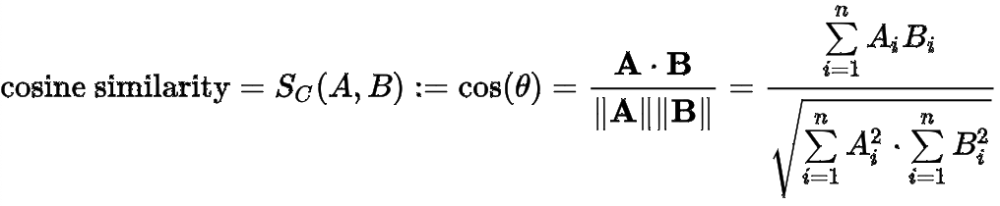

# 向量数据库

## 什么是向量数据

向量数据是由多个数值组成的序列，可以表示一个数据量的大小和方向。通过 Embedding 技术，图像、声音、文本都可以被表达为一个高维的向量，比如一张图片可以转换为一个由像素值构成的向量。

## 什么是向量数据库

向量数据库就是用来存储，检索，分析向量的数据库。它是对传统关系数据库的扩展，专注于高维向量的存储、索引和查询。

## 向量数据库的用途

向量数据库是基于 embedding 之后的向量的存储与检索。所以首先需要提供存储能力，其次还支持对向量数据进行各种操作，如：
- 向量检索：根据给定的向量，找出数据库中与之最相似的向量，例如在图像向量数据库中，用户输入一张图片进行搜索时，先将这张图片转换为一个向量，通过向量之间的近似检索，找到与输入图片最相似的图片。
- 向量聚类：根据给定的相似度度量，将数据库中的向量分类，例如根据图片的内容或风格，将图片分成不同的主题。
- 向量降维：根据给定的目标维度，将数据库中的高维向量转换成低维向量，以便于可视化或压缩存储。
- 向量计算：根据给定的算法或模型，对数据库中的向量进行计算或分析，例如根据神经网络模型，对图片进行分类或标注。

## 向量数据库的原理

下面来以狗的分类来引入向量数据库的基本原理。

对于不同的狗的品种，我们可以轻松地将其进行区分，是因为我们会从不同的角度来观察他们的特征，比如说体型大小，毛色种类，毛发长短，鼻子长短，是否立耳，腿的长短，甚至是服从性，攻击性这些抽象概念等等。

以这种思路，我们将狗的每一种特征量化为数字，坐落在一个坐标轴上，那么每种狗都可以在这个坐标系里得到一个坐标点。我们使用的维度越多，对狗的区分能力就越强，同时坐标点所在的空间维度也就越高。虽然多维的坐标系在现实世界中并不存在，但是在数学上却很容易实现，多一个维度只需要在坐标点后继续追加即可。

以此类推，不仅是狗，花鸟鱼虫，飞禽走兽，喜怒哀乐，悲欢离合，总会在不同的特征维度中有着不同的表现，最终在一个高维的特征空间中对应一个坐标点，以坐标原点为起点，坐标点为终点，就可以构建一个个大小方向各异的向量。

这些向量还有一些有趣的特性，比如概念上更为接近的向量其相似性越高。比如警察的向量减去小偷的向量得到的结果向量与猫减去老鼠的向量有一定的相似性，这使得向量间还能存在一定的推理能力。

如果将图片、视频进行向量化，则可以通过相似的向量搜索找到相关的图片、视频来实现搜索功能。如果将文本进行向量化，则可以针对当前的对话找到已经进行过的对话以供参考。

## 余弦相似性

从上面的介绍可以看出，探究两个向量的相似性是向量数据库中的重要课题。

余弦相似性通过测量两个向量的夹角的余弦值来度量它们之间的相似性。

0度角的余弦值是1，而其他任何角度的余弦值都不大于1；并且其最小值是-1。从而两个向量之间的角度的余弦值确定两个向量是否大致指向相同的方向。两个向量有相同的指向时，余弦相似度的值为1；两个向量夹角为90°时，余弦相似度的值为0；两个向量指向完全相反的方向时，余弦相似度的值为-1。

这结果是与向量的长度无关的，仅仅与向量的指向方向相关。余弦相似度通常用于正空间，因此给出的值为0到1之间。注意这上下界对任何维度的向量空间中都适用，而且余弦相似性最常用于高维正空间。

例如在信息检索中，每个词项被赋予不同的维度，而一个文档由一个向量表示，其各个维度上的值对应于该词项在文档中出现的频率。余弦相似度因此可以给出两篇文档在其主题方面的相似度。

## 向量相似搜索

在[向量数据库的用途](#向量数据库的用途)一节中我们提到，向量数据库的一个主要应用场景就是给定一个查询向量然后从众多向量中找到最为相似的一些，即所谓【近似最近邻（Approximate Nearest Neighbor, ANN）】问题。

因此向量的相似搜索是非常重要的一环，常见的相似搜索算法有：

- 基于树的方法：经典算法 KD 树。当空间维度较高时，该方法会退化为暴力枚举，性能较差。
- 基于哈希方法：代表算法 [LSH](#局部敏感哈希算法)。对于小数据集和中规模的数据集(百万千万级)，基于LSH的方法的效果和性能都还不错。
- 矢量量化方法：代表算法 PQ。对于大规模数据集(亿级以上)，基于矢量量化的方法是一个明智的选择。

### 聚类

聚类（Clustering）是一种无监督学习方法，旨在将数据对象划分为相似的组或簇，使得同一簇内的对象更相似，而不同簇之间的对象差异较大。聚类算法分析数据的相似性，并根据相似性创建簇。聚类可以帮助识别数据中的内在结构、发现潜在的模式和组织数据。

目前最为流行的 K-means 聚类算法的大致思路为：

1. 选择初始化的 k 个样本作为初始聚类中心 a = a1, a2,… , ak；
2. 针对数据集中每个样本 xi 计算它到 k 个聚类中心的距离并将其分到距离最小的聚类中心所对应的类中；
3. 针对每个类别 aj，重新计算它的聚类中心。
4. 重复上面 2、3 两步操作，直到达到某个中止条件（迭代次数、最小误差变化等）。

> K-means 有一个著名的解释，牧师—村民模型：
> 
> 有四个牧师去郊区布道，一开始牧师们随意选了几个布道点，并且把这几个布道点的情况公告给了郊区所有的村民，于是每个村民到离自己家最近的布道点去听课。
> 
> 听课之后，大家觉得距离太远了，于是每个牧师统计了一下自己的课上所有的村民的地址，搬到了所有地址的中心地带，并且在海报上更新了自己的布道点的位置。
> 
> 牧师每一次移动不可能离所有人都更近，有的人发现A牧师移动以后自己还不如去B牧师处听课更近，于是每个村民又去了离自己最近的布道点……
> 
> 就这样，牧师每个礼拜更新自己的位置，村民根据自己的情况选择布道点，最终稳定了下来。
> 
> 我们可以看到该牧师的目的是为了让每个村民到其最近中心点的距离和最小。

### 量化

量化是一种数据压缩技术，旨在将高维数据转化为低维表示，同时保持数据的重要特征。

量化方法将原始数据映射到一组离散的码本（codebook）或离散值，以减少数据的维度和存储需求。

### 维度灾难

在向量数量一定的情况下，向量维度越多，向量在空间中的分布越呈现稀疏性。稀疏性对于任何要求有统计学意义的方法而言都是一个问题，为了获得在统计学上正确并且有可靠的结果，用来支撑这一结果所需要的数据量通常随着维数的提高而呈指数级增长，这就是维度灾难。

解决维度灾难的一大思路就是降维，降维是通过将数据点映射到更低维的空间上以寻求数据的紧凑表示的一种技术，这种低维空间的紧凑表示将有利于对数据的进一步处理。

### 乘积量化算法

乘积量化（Product Quantization, PQ）算法是一种用于高维向量压缩和加速相似度搜索的算法。它通过将高维向量分解为多个子向量，并使用离散的码本（codebook）进行量化，从而将向量表示的维度大大减小，减轻维度灾难的影响。

PQ 算法的基本原理如下：

1.**分割向量**：将高维向量分割为多个子向量。例如，将一个128维向量分割为8个16维的子向量。

2.**子空间聚类、量化编码**：对每个子向量进行聚类训练，将聚类后的结果进行量化，使每个子向量映射到离散码本中最接近的离散码字。这样，每个子向量就被替换为对应的码字，从而实现向量的压缩。例如，每个16维的子向量大约需要256个聚类数量，因此离散码字的范围大致为0~255，每个子向量可以被替换为0~255的量化编码值。

3.**相似度搜索**：在搜索时，查询向量也按照相同的方式进行分割和量化，并与已量化的向量进行比较。通过比较码字的相似性，可以快速找到最相似的向量。常见的有 SDC/ADC 算法。

4.**索引结构**：为每个子向量的离散码字建立索引结构，以支持高效的相似度搜索。通常使用一种索引结构（如倒排索引，IVFPQ 算法）来加速查询过程。

> 对于向量空间笛卡尔积的理解
>
> 定性地看，一个二维向量空间可以看做是两个一维向量空间的笛卡尔积，同样，一个三维向量空间也可以看做是三个一维向量空间或者一个二维向量空间与一个一维向量空间的笛卡尔积。
>
> 以此类推，高维的空间总是可以分解为若干个低维向量空间的笛卡尔积。这也是 PQ 算法的名称由来。
>

PQ 算法通过将向量分解为子向量并分别量化，将高维向量压缩为多个低维码字的组合。这样可以显著减小存储需求，并且在相似度搜索任务中，使用离散码字进行比较可以提供较快的查询速度。
需要注意的是，PQ 算法的性能和效果取决于子向量的划分和量化过程，以及码本的选择和索引结构的设计。合理选择子向量的维度、码本大小和索引结构，以及进行合适的参数调优，可以获得更好的压缩效果和搜索性能。

### 局部敏感哈希算法

局部敏感哈希（Locality-Sensitive Hashing, LSH）算法是一种用于高维向量相似性搜索的近似算法，可以帮助快速找到在高维空间中相似的向量对，尤其在大规模向量数据的情况下，提供高效的近似搜索能力。

LSH 算法使用哈希的方法把数据从原空间经过哈希映射到一个新的空间，使得在原空间相似的数据，在新的空间中也相似的概率很大，而在原始空间不相似的数据，在新的空间中相似的概率很小。

LSH 算法的基本原理如下：

1.**哈希函数**：使用哈希函数来将高维向量映射到低维空间，通常是一个或多个哈希表。

2.**分桶**：通过哈希函数的映射，将相似的向量映射到相同的桶（bucket）中。这样，相似的向量将在低维空间中被聚集在一起。

3.**相似性查询**：当需要寻找相似向量时，可以使用 LSH 算法在低维空间中查询相应的桶，然后在这些桶中找到近似的向量对。

由于 LSH 算法的近似性质，相似性搜索结果可能包含一些误差，但在实际应用中，LSH 能够以较小的计算成本找到近似相似的向量，从而提供了高效的近似搜索方案。LSH适用于处理大规模高维向量数据，如图像特征、文本嵌入、语音特征等。

常见的 LSH 算法有：

- 最小哈希(MinHash)：用于处理文档相似性和集合相似性问题。
- SimHash
- Random Projection：通过随机投影实现向量降维。
- [支持向量机(Support Vector Machine, SVM)](https://zhuanlan.zhihu.com/p/49331510)

LSH 算法在大规模数据集的近似相似性搜索方面发挥着重要的作用，特别是在推荐系统、相似图片搜索和聚类等领域。

[//]: # (## KNN)

## 目前主流的向量数据库

### Milvus

Milvus 是一个由 Zilliz 公司开发的开源向量数据库。它支持高效的相似度搜索和向量数据存储，并提供 Python、Java、C++ 等多种语言的 SDK。

### Faiss

Faiss (Facebook AI Similarity Search) 是 Facebook 开源的向量相似性搜索库。

### ANNoy

ANNoy (Approximate Nearest Neighbors Oh Yeah) 是一个由 Spotify 开源的近似最近邻搜索库，支持高维向量的快速搜索。

### Qdrant

Qdrant 是一个由 Rust 编写的矢量相似性搜索引擎和矢量数据库，提供高可用性、性能稳定和可靠性的服务。

### weaviate

Weaviate 是一个开源矢量数据库，它同时存储对象和矢量，允许将矢量搜索与结构化过滤与云原生数据库的容错和可扩展性相结合，所有这些都可以通过 GraphQL、REST 和各种语言客户端访问。

> 参考资料：
> 
> 【上集】向量数据库技术鉴赏：https://www.bilibili.com/video/BV11a4y1c7SW
>
> 【下集】向量数据库技术鉴赏：https://www.bilibili.com/video/BV1BM4y177Dk
>
> 向量数据库介绍：https://zhuanlan.zhihu.com/p/40487710
>
> 【机器学习】K-means（非常详细）：https://zhuanlan.zhihu.com/p/78798251
> 
> 看了这篇文章你还不懂SVM你就来打我：https://zhuanlan.zhihu.com/p/49331510
> 
> ANN召回算法之IVFPQ：https://zhuanlan.zhihu.com/p/378725270
> 
> 理解 product quantization 算法：http://vividfree.github.io/机器学习/2017/08/05/understanding-product-quantization
> 
> 深入浅出KNN算法（一） KNN算法原理：https://www.cnblogs.com/listenfwind/p/10311496.html

