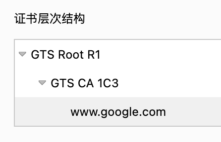

# 应用密码学

## 什么是密码学？

密码学是一种通过使用编码算法、哈希和签名来保护信息的实践科学。

密码学有四个主要目标：

- 安全性 – 仅将信息提供给授权用户。
- 完整性（integrity） – 确保信息未受到篡改。
- 真实性（authenticity） – 确认信息或用户身份的真实性。
- 不可否认性（non-repudiation） – 防止用户否认先前的承诺或操作。

## 密码学的用途

1. 加密与密钥：保证数据的安全存储和安全传输。
2. 数字签名与消息认证：数字签名算法与消息认证（MAC）算法保证了消息的真实性、完整性和不可否认性。
3. 安全随机数：生成不可预测的安全随机数。
4. 密钥交换：用于在需要安全传输消息的两方之间安全地构建加密密钥。
5. 加密哈希与 Password 哈希：加密哈希函数将消息转换为消息摘要/数字指纹（固定长度的散列），确保无法逆向出原始消息，并且几乎不可能找到具有相同哈希值的两条不同消息。

## 加密哈希函数
参考：[《hash.md》](../../data_structure/hash.md#在密码学中的应用---加密哈希函数)

## 密钥交换

在密码学中密钥交换是一种协议，目的是双方安全地交换加密密钥，其他任何人都无法获得密钥的副本。
通常各种加密通讯协议的第一步都是密钥交换。

密钥交换技术有两种方案：
- 密钥协商：协议中的双方都参与了共享密钥的生成。代表算法有：
  - [迪菲-赫尔曼密钥交换算法（DHKE）](#迪菲-赫尔曼密钥交换diffiehellman-key-exchange)
  - [椭圆曲线迪菲-赫尔曼秘钥交换算法（ECDH）](#ecdh-椭圆曲线迪菲-赫尔曼秘钥交换算法)
- 密钥传输：由其中一方生成出共享密钥，并将共享密钥传输给另一方。

### 迪菲-赫尔曼密钥交换（Diffie–Hellman Key Exchange）

迪菲-赫尔曼密钥交换是一种在双方在完全没有对方任何预先信息的条件下，通过不安全信道安全地协商出一个安全密钥的算法。
而且任何窃听者都无法得知密钥信息。这个密钥可以在后续的通讯中作为对称密钥来加密通讯内容。

#### 数学原理 - 离散对数与模幂

##### 模幂（Modular exponentiation）
模幂是指求整数 g 的 a 次幂模质数 p 的值 c 的过程，其中 g, a, p, c 均为整数，公式如下：

`(g ^ a) mod p = c`

##### 离散对数（Discrete logarithms）

就是指模幂的逆运算，是已知整数 g，质数 p，以及余数 c 的情况下，求幂指数 a。

> 计算上述「模幂」是非常快速的，但是在质数 p 非常大的情况下，目前并没有有效的手段可以快速计算出幂指数 a 的值
，这就是「离散对数难题」。

#### DHKE 协议流程

步骤大致如下：

1. 双方协定一个共享整数 p 作为公用模数, 以及一个共享整数 g 作为公用基数。
2. 双方各随机生成一个整数 a, b 各自保管。
3. 各计算出模幂结果：`A = (g ^ a) % p`, `B = (g ^ b) % p`。
4. 双方将自己的计算结果 A, B 发送给对方。
5. 各自将收到对方的结果和自己保管的整数进行模幂运算，即计算 
  `Sa = (B ^ a) % p = (g ^ b ^ a) % p` 和 `Sb = (A ^ b) % p = (g ^ a ^ b) % p`。
   显然 `Sa = Sb`，此刻双方获得了一个相同的共享密钥。

此后，双方可以通过相同的共享密钥进行对称加密来安全地传输数据。

## 对称加密算法

对称加密（Symmetric cryptography）算法是历史悠久、非常成熟的加密算法，要求在加密（encrypt）和解密（decrypt）时使用相同的密钥。

这组密钥称为「共享密钥（Shared Secret Key）」。

这组密钥成为在两个或多个成员间的共同秘密，以便维持专属的通信联系。

### 特点

对称加密算法的特点是算法公开、计算量小、加密速度快、加密效率高。

要求双方获取相同的密钥是对称密钥加密的主要缺点之一。

对称算法的安全性依赖于密钥，泄漏密钥就意味着任何人都可以对他们发送或接收的消息解密，所以密钥的保密性对通信的安全性至关重要。

另外，每对用户每次使用对称加密算法时，都需要使用其他人不知道的独一密钥，这会使得收、发双方所拥有的钥匙数量巨大，密钥管理成为双方的负担。

大多数现代对称密钥密码算法都是量子安全的，这意味当使用长度足够的密钥时，很长一段时间内强大的量子计算机无法破坏其安全性。

### 常见算法

#### AES（Rijndael）

AES（高级加密标准，也称为 Rijndael）是现代 IT 行业中最流行和广泛使用的对称加密算法。

AES 被证明是高度安全、快速且标准化的，到目前为止没有发现任何明显的弱点或攻击手段，而且几乎在所有平台上都得到了很好的支持。很多站点都选择 AES 作为 TLS 协议的一部分，以实现安全通信。 现代 CPU 硬件基本都在微处理器级别实现了 AES 指令以加速 AES 加密解密操作。

AES 是 128 位分组密码，使用 128、192 或 256 位密钥。

#### Salsa20 / ChaCha20

Salsa20 及其改进的变体 ChaCha（ChaCha8、ChaCha12、ChaCha20）和 XSalsa20 是由密码学家 Daniel Bernstein 设计的现代、快速的对称流密码家族。

在没有硬件加速的情况下，ChaCha20 通常比 AES 要快得多（比如在旧的没有硬件加速的移动设备上），这是它最大的优势。

#### 其他流行的对称加密算法

- Serpent
- Twofish
- Camellia
- RC5
- RC6
- IDEA
- CAST (CAST-128 / CAST5, CAST-256 / CAST6)
- ARIA
- SM4

## 非对称加密算法

非对称加密（Asymmetric cryptography）是密码学的一种算法，它需要两个密钥，一个是公开密钥，另一个是私有密钥；一般来说公钥用作加密，私钥则用作解密。

使用公钥把明文加密后所得的密文，只能用相对应的私钥才能解密并得到原本的明文，最初用来加密的公钥不能用作解密。 

由于加密和解密需要两个不同的密钥，故被称为非对称加密；

公钥可以公开，可任意向外发布；私钥不可以公开，必须由用户自行严格秘密保管，绝不透过任何途径向任何人提供，也不会透露给被信任的要通信的另一方。

### RSA 加密算法

RSA 密码系统是最早的公钥密码系统之一，在计算机密码学的早期被广泛使用，至今仍然是数字世界应用最广泛的密码算法。

#### 安全性

RSA 算法基于质因数分解问题（IFP）的计算难度来提供安全性。

RSA 算法是量子不安全 (quantum-unsafe) 的。

#### 公钥和私钥的计算方法

1. 随机选择两个不相等的质数 p 与 q。
2. 计算出 n = pq。
3. 计算欧拉函数的值 `Φ(n) = Φ(pq) = (p-1)(q-1)`
4. **选择**公钥指数 e，要求 `1 < e < Φ(n)`，且 e 与 Φ(n) 互质。
5. **计算**私钥指数 d，其中 `(e × d) % Φ(n) = 1`。
6. 使用 (n, e) 组成公钥，使用 (n, d) 组成私钥。其他参数可以保存在私钥中，也可丢弃。p, q, Φ(n), d 四个参数都必须保密，绝不能泄漏！

根据上述方法求出的 e 和 d，存在一些特殊的数学性质，在加密和解密运算中可以体现。

#### 加密运算

现有一个明文 m，那么根据[模幂](#模幂modular-exponentiation)公式 `(m ^ e) % n`，求出密文 c。

#### 解密运算

拿到密文 c 后，根据模幂公式 `(c ^ d) % n`，则可以求出明文 m。

### ECC 椭圆曲线加密算法

ECC 椭圆曲线密码学，于 1985 年被首次提出，并于 2004 年开始被广泛应用。 

ECC 被认为是 RSA 的继任者，随着 ECC 密码学的发展，ECC 正在非对称密码系统中慢慢占据主导地位，因为它比 RSA 具有更高的安全性、更快的密钥对生成速度和更短的密钥长度。

#### 安全性

ECC 算法基于椭圆曲线离散对数问题（ECDLP）的计算难度来提供安全性。

#### 数学原理 - 椭圆曲线运算

##### 加法
对于曲线上的任意两点 A 与 B，我们定义过 A, B 的直线与曲线的交点为 -(A+B)，而 -(A+B) 相对于 x 轴的对称点即为 A+B:

##### 二倍运算
在加法规则中，如果 A = B，我们定义曲线在 A 点的切线与曲线的交点为 -2A，于是得到二倍运算的规则

##### k倍运算

k 倍运算最简单的计算方法，就是不断地进行加法运算。

已知一个基点 G，经过 k 倍运算，可以得到点 kG。

即 `kG = k * G`。

但如果已知点 kG 与基点 G，目前并没有有效的手段可以快速计算出 k 的值。

> ECC 底层的数学难题 EC DLP 与 DH 算法的离散对数问题，RSA 算法质因数分解问题也有很大相似性。
> 
> 在密码学中使用这些数学难题都是为了通过一个简单的运算加密信息，而通过难以解决的逆运算来提高信息的破解复杂度。

### ECDH 椭圆曲线迪菲-赫尔曼秘钥交换算法

ECDH 是椭圆曲线与 [DH 算法](#迪菲-赫尔曼密钥交换diffiehellman-key-exchange)混合起来的密钥交换算法，步骤大致如下。

1. 共享双方所共同使用的椭圆曲线 E，基点 G。
2. 双方各随机生成一个密钥 a, b 各自保管。
3. 各计算出密文公钥：`A = a * G`, `B = b * G`。
4. 双方将自己的密文公钥 A, B 发送给对方。
5. 各自将收到对方的密文公钥和自己原本生成的密钥进行 k 倍运算，即计算 
  `Ga = a * B = a * b * G` 和 `Gb = b * A = b * a * G`。
  显然 `Ga = Gb`，此刻双方获得了一个相同的共享密钥。

此后，双方可以通过相同的共享密钥进行对称加密来安全地传输数据。

## 混合加密

正如上文中所介绍的，对称加密算法计算量小，加解密效率高，适合对大量数据进行加密，但是缺乏安全交换密钥的手段，且客户量较大时，如何合理管理密钥也会成为一大问题。

非对称加密有安全的密钥交换算法，且公钥是可公开的，降低了密钥的管理难度，但是非对称加密加解密成本大、速度慢，只适合对少量数据进行加密。

所以在实际生产中，一般会使用将对称加密和非对称加密组合的方式来进行数据加密传输，即混合加密，它结合了对称加密和非对称加密的优点，而规避了其短处。

> 混合加密广泛用于 Web 的数据传输协议，例如传输层安全性协议（TLS）。当连接到使用 HTTPS（使用 TLS 的 HTTP 安全）的网站时，
> 浏览器将协商保护连接的加密算法。其中包括用于密钥交换、对称加密和数字签名的算法。

常见的混合加密方案有「密钥封装机制 KEM（Key encapsulation mechanisms)）」与「集成加密方案 IES」。

### 密钥封装机制 KEM

密钥封装机制（Key encapsulation mechanisms）就是使用非对称加密算法将对称加密密钥进行加密并传输，而使用对称加密算法来加密实际数据。

KEM 流程：
假定对称加密密钥为 SKey，用户公钥为 UPKey，用户私钥为 UKey。
1. 使用 SKey 对源数据进行加密。
2. 使用 UPKey 对 SKey 进行加密。
3. 将加密后的数据和 SKey 进行传输。
4. 用户收到数据后，使用私钥 UKey 对 SKey 进行解密。
5. 用户使用解密后的 SKey 对源数据进行解密。

### 集成加密方案 IES

集成加密方案（Integrated Encryption Scheme）是在密钥封装机制（KEM）的基础上，添加了密钥派生算法 KDF、 消息认证算法 MAC 等其他密码学算法以达成更高的安全性。

单纯使用数据加密算法只能保证数据的安全性，并不能满足我们对消息真实性、完整性与不可否认性的需求，因此通常我们会将加密算法组合成一个「加密方案」来使用。

DLIES（离散对数集成加密方案）和 ECIES（椭圆曲线集成加密方案）都是 IES 方案。

## 数字签名

原始数据经过哈希算法得到哈希值，称为摘要（Digest）。使用私钥将摘要进行加密，即得到数字签名。

> 计算数据的哈希值不是数字签名的必要步骤。只是一般来说哈希值的长度远小于原始数据，可使签名的效率大大提高。

数字签名可确保数据的完整性、真实性和不可否认性。

### 数字签名算法（DSA）

数字签名算法的一般步骤为：

- 使用哈希算法计算原始数据的 Hash 值，比如 SHA256。
- 使用私钥对计算出的 Hash 值进行加密，得到数字签名。
- 其他人使用公开的公钥进行解密出 Hash 值，再对原始数据计算 Hash 值对比，如果一致，就说明数据未被篡改。

常见的数字签名算法：

- RSA 数字签名算法
- ECDSA 椭圆曲线数字签名算法

## 消息认证码

消息认证码（Message authentication code，MAC）是经过特定算法后产生的一小段信息，用于检查某段消息的完整性，以及作身份验证。

消息认证码的算法中，通常会使用带密钥的散列函数（HMAC），或者块密码的带认证工作模式（如GCM，CCM）。

MAC 可以是独立的算法，然而，由于消息完整性几乎总是一种有价值的保证，因此它经常被集成到对称加密算法中，如 AES-GCM。

## 数字证书与公钥基础架构

之前介绍的加密方案已经可以防范嗅探攻击（窃听），但是对于中间人攻击却没有很好的应对手段。也就是说无法很好的确认公钥的真实性、完整性，认证其来源身份。

### 公钥基础架构

公钥基础架构（Public Key Infrastructure）是一组由硬件、软件、参与者、管理政策与流程组成的基础架构，其目的在于创造、管理、分配、使用、存储以及撤销数字证书。 

PKI 是一个总称，而并非指单独的某一个规范或标准，因此数字证书的规范（X.509）、存储格式（PKCS系列标准、DER、PEM）、TLS 协议等都是 PKI 的一部分。

PKI 通过「数字证书」+「数字证书认证机构」来解决「在分发公钥时，难以确认公钥的真实性、完整性及其来源身份」的问题。

### 数字证书

数字证书指的就是公钥证书，本质即对公钥添加数字签名。

在现代网络通讯中通行的公钥证书标准名为 X.509 v3，由 RFC5280 定义。 X.509 v3 格式被广泛应用在 TLS/SSL 等众多加密通讯协议中。 它规定公钥证书应该包含如下内容:

- 证书
  - 主体（Subject）: 即姓名、组织、邮箱、地址等证书拥有者的个人信息。
  - 签发者（Issuer）: 签发此证书的「签发者」信息。
  - 序列号（Serial Number）: 用以识别每一张证书，在作废证书的时候会用到它。
  - 版本: 证书的规范版本。
  - 公钥（Public Key）
  - 公钥指纹: 即公钥的 Hash 值，当前大部分证书都使用 SHA256 计算此指纹。
  - 公钥用途（Key Usage + Extended Key Usage）: 记录了此证书可用于哪些用途——数字签名、身份认证等。
  - 证书有效期的开始时间、结束时间（Not Before + Not After）: 证书一旦签发并公开，随着科技的发展、时间的推移，其公钥的安全性会慢慢减弱。因此每个证书都应该包含一个合理的有效期，证书的拥有者应该在有效期截止前更换自身的证书以确保安全性。
  - 其他扩展信息。
- 数字签名（Signature）: 我们还需要对上面整个证书计算一个数字签名，来确保这些数据的真实性、完整性，确保证书未被恶意篡改/伪造。此数字签名由「证书签发者（Issuer）」使用其私钥与证书内容计算得出。
- 数字签名算法（Signature Algorithm）: 证书所使用的签名算法，常用的有 RSA-SHA-256 与 ECDSA-SHA-256。

下图为 `https://www.google.com` 的数字证书。

### 数字证书认证机构

数字证书解决了公钥的真实性、完整性及其来源身份的问题，但是签发者（Issuer）本身是否值得信赖又成为一个新的问题。

PKI 引入了一个可信赖的第三方（Trusted third party，TTP）来解决这个问题，这个第三方被称作「数字证书认证机构（Certification Authority, CA）」。

数字证书认证机构（英语：Certificate Authority，缩写为 CA），也称为电子商务认证中心、电子商务认证授权机构，是负责发放和管理数字证书的权威机构，并作为电子商务交易中受信任的第三方，承担公钥体系中公钥的合法性检验的责任。

#### 证书申领及使用的大致流程

现假设 Alice 要和 Bob 进行加密传输，可信赖的第三方为 Eve。

- Eva 使用私钥为自己的公钥证书签名，生成一个「自签证书」，并将这个「自签证书」可靠地分发给了 Alice 跟 Bob。
- Alice 使用自己的公钥以及主体信息、使用目的等组成「证书签署请求（Certificate Signing Request, CSR）」，并提交给 Eve。
- 在验证了 Alice 的身份后，Eve 作为 Issuer，使用自己的私钥和 Alice 的公钥，计算出证书的数字签名。加上 Alice 的主体信息、证书有效期、用途等限制条件，组合出完整的证书文件，签发给 Alice。
- Alice 再将经 Eve 签名的证书发送给 Bob。
- Bob 收到证书后，看到 Issuer 是 Eve。于是找出以前 Eve 给他的「自签证书」，使用其中的公钥验证收到证书的真伪。

在上述流程中，Eve 则扮演着类似 CA 机构的角色。

不过如果 CA 机构直接使用自己的私钥处理各种证书签名请求，这将是非常危险的。私钥一旦泄漏，那将直接影响海量网站的安全性。在现实世界中，使用数字证书链的机制来解决这个问题。

### 数字证书链

数字证书链，或称信任链，由一连串层层信任的数字证书组成。由根证书为起点，凭借对签发机构的信任，使信任链终端的证书持有者也可以获得转授的信任，以证明身份。

下图为 `https://www.google.com` 的证书链。

#### 根证书

根证书（Root Certificate）是属于根证书颁发机构的数字证书，是在公开密钥基础建设中，信任链的起点，会被预先安装到操作系统、网页浏览器等程序中。

#### 中介证书

因为密钥管理和行政考虑，CA 机构一般会先行签发中介证书，才为客户作数字签署。中介证书的有效期会较根证书为短，并可能对不同类别的客户有不同的中介证书作分工。

#### 自签证书

根证书没有上层机构再为其本身作数字签名，所以都是自签证书。

另外，如果使用场景是局域网内，且客户端是完全可控的（比如企业局域网设备），那么可以自己生成本地证书链（私有 PKI），签发「本地签名证书」，并在所有客户端都安装这些证书。这种场景下使用此类证书是安全可靠的。

## TLS 协议

传输层安全性协议（Transport Layer Security，TLS），前身称为安全套接层（Secure Sockets Layer，SSL），是一种安全协议，目的是为互联网通信提供安全及数据完整性保障。

TLS 协议通常与 HTTP / FTP / SMTP 等协议一起使用以实现加密通讯，这种组合协议通常被缩写为 HTTPS / SFTP / SMTPS.

TLS 协议是一个「混合加密方案」，它借助数字证书与 PKI 公钥基础架构、DHKE/ECDHE 密钥交换协议以及对称加密方案这三者，实现了安全的加密通讯。

### 密码套件

密码套件（Cipher suite）是 TLS/SSL 网络协议中由通信双方共同约定的一组用于实现安全通讯的密码学算法组合，由密钥交换算法、身份认证算法、数据加密算法和消息认证码算法的组合。

不同密码学算法的组合形成不同的密码套件，算法组合的差异使这些密码套件具有不同的性能与安全性，另外 TLS 协议的更新迭代也导致各密码套件拥有不同的兼容性。 通常越新推出的密码套件的安全性越高，但是兼容性就越差（旧设备不支持）。

以上图中的 `TLS_ECDHE_RSA_WITH_AES_128_GCM_SHA256` 为例说明（TLSv1.2）：

- TLS：定义了此套件适用的协议，通常固定为 TLS。
- ECDHE：密钥交换算法
- RSA：数字证书认证算法
- AES_128_GCM：数据的批量加密算法，这是一个基于 AES 与 GCM 模式的对称加密方案，使用 128 位密钥。
- SHA256：基于哈希函数的消息认证码算法，TLS 中一般使用 HMAC。

### TLS 发展历史

#### SSL 1.0、2.0 和 3.0

网景公司（Netscape）在1994年推出首版网页浏览器－网景导航者时，推出以 SSL 进行加密的 HTTPS 协议，这是 SSL 的起源。

2014年10月，Google发布在 SSL 3.0 中发现设计缺陷，建议禁用此一协议。

2015年，RFC 7568 标准弃用了SSL 3.0。

#### TLS 1.0

1999年 IETF 将 SSL 标准化，公布 TLS 1.0 标准文件（RFC 2246）。

#### TLS 1.1

TLS 1.1 在 RFC4346 中定义，于2006年4月发布。

TLS 1.1 是 TLS 1.0 的一个补丁，主要更新包括：

- 添加对CBC攻击的保护。
  - 隐式初始向量 IV 被替换成一个显式的 IV。
  - 修复分组密码模式中填充算法的 bug。
- 支持 IANA 登记的参数。

TLS 1.1 目前已知的缺陷如下：

- 不支持 PFS 完全前向保密。
- 不支持 AEAD 认证加密算法。
- 为了兼容性，保留了很多不安全的算法。

TLS 1.0 及 1.1 版本已被认为不够安全。2021年3月，RFC 8996 标准弃用了 TLS 1.0 和 TLS 1.1。

#### TLS 1.2

TLS 1.2 在 RFC5246 中定义，于2008年8月发布。

主要更新包括：

- 可选支持 PFS 完全前向保密协议。
- 移除对 MD5 与 SHA-1 签名算法的支持。
- 添加对 HMAC-SHA-256 及 HMAC-SHA-384 消息认证算法的支持。
- 添加对 AEAD 加密认证方案的支持。
- 去除回滚到 SSL 协议的做法，提升安全性。
- 为了兼容性，保留了很多不安全的算法。

##### PFS 完全前向保密协议

完全前向保密（Perfect Forward Secrecy，PFS）是指长期使用的主密钥泄漏不会导致过去的会话密钥泄漏，从而保护过去进行的通讯不受密码或密钥在未来暴露的威胁。

上文介绍过的 DHKE 与 ECDH 密钥交换协议都是在最开始时交换一次密钥，之后就一直使用该密钥通讯。 如果密钥被破解，整个会话的所有信息对攻击者而言就完全透明了。

因此为了进一步提高安全性，密码学家提出了「完全前向保密」的概念，并在 DHKE 与 ECDH 的基础上提出了支持 PFS 的 DHE/ECDHE 协议（末尾的 E 是 ephemeral 的缩写，即指所有的共享密钥都是临时的），如基于 DHKE 的 DHE-RSA、DHE-DSA 和 DHE-ECDSA 以及基于 ECDHE 的 ECDHE-RSA 与 ECDHE-ECDSA。

#### TLS 1.3

TLS 1.3在 RFC 8446 中定义，于2018年8月发表。

TLS 1.3 做了一次大刀阔斧的更新，是一个里程碑式的版本，其更新总结如下：

- 移除了对 SHA1/MD5 哈希函数的支持。
- 移除了对所有非 AEAD 加密认证（CBC 模式）的密码方案的支持。
- 移除了对 RC4 与 3DES 加密算法的支持。
- 移除了对静态 RSA 与 DH 密钥交换算法的支持。
- 仅支持 AEAD 认证加密方案。
- 仅支持前向安全的密钥交换算法 DHE 或 ECDHE。
- 支持高性能的 Ed25519/Ed448 签名认证算法、X25519 密钥协商算法。
- 支持高性能的 ChaCha20-Poly1305 对称认证加密方案。
- 将密钥交换算法与公钥认证算法从密码套件中分离出来。比如原来的 `TLS_ECDHE_RSA_WITH_AES_128_GCM_SHA256` 密码套件将被拆分为 ECDHE 算法、RSA 身份认证算法、以及 TLS_AES_128_GCM_SHA256 密码套件。
- 支持最短 0-RTT 的 TLS 握手（会话恢复）
    
TLS 1.3 目前被认为是足够安全的，性能较1.2版本有所提升，但是兼容性较差。

## SSH 协议

参考：[《ssh.md》](../../terminal/ssh.md)

参考资料：

> [写给开发人员的实用密码学](https://thiscute.world/series/写给开发人员的实用密码学/)
