# 树莓派

## 介绍

树莓派（Raspberry Pi）是一款低成本的、基于Linux系统的单板计算机，由英国的树莓派基金会（Raspberry Pi Foundation）开发制造。

它的目的是促进计算机科学的教育，并提供一个实用的平台，让人们可以学习编程、DIY项目以及搭建各种计算机系统。

树莓派采用了小巧的尺寸和低功耗设计，拥有丰富的接口和扩展性，可用于各种项目，如智能家居控制、媒体中心、网络服务器、物联网设备等。

## 参数（树莓派 5）

- CPU：BCM2712 64 位 4x Cortex-A76 @2.4GHz Arm，512KB 二级缓存和 2MB 共享三级缓存
- GPU：VideoCore VII GPU @800MHz，支持 OpenGL ES 3.1 和 Vulkan 1.2；4K 60Hz HEVC 解码器
- 内存：8GB 32bit LPDDR4X-4267 SDRAM
- 存储：高速 UHS-I Micro SD 卡接口，支持 SDR104 模式
- Wi-Fi：2.4GHz/5GHz 双频 802.11b/g/n/ac
- 蓝牙：蓝牙 5.0 / 低功耗蓝牙 (BLE)
- USB接口：2 × USB 3.0 端口，支持 5Gbps 同步运行；2 × USB 2.0 端口
- 网线接口：千兆以太网，支持 PoE+ (需要单独的 PoE+ HAT，即将推出)
- 视频接口：支持HDR 双 micro HDMI接口，支持4K 60Hz（HDMI 2.0）显示输出
- GPIO 接口：Raspberry Pi 40PIN GPIO 接口
- PCIe 接口：PCIe 2.0 x1 接口 (需要单独的 M.2 HAT 或其他适配器)
- MIPI 接口：2 × 4-lane MIPI DSI/CSI 接口
- 实时时钟 (RTC)，由外置电池供电 (需单独购买)
- 电源：通过 USB-C 提供直流电源，支持 PD，5V/5A达到最佳性能，5V/3A为最低要求。板载电源按钮

## 装前必备

- 树莓派5主板
- 内存卡加读卡器
- 电源
- micro HDMI 线（或 HDMI 线加转接头）
- 显示器
- 鼠标键盘

## 安装镜像烧录

> 本手册中安装树莓派官方操作系统 Raspberry Pi OS

### 下载镜像烧录器

登录[树莓派官网-Software](https://www.raspberrypi.com/software/)，下载镜像烧录软件。

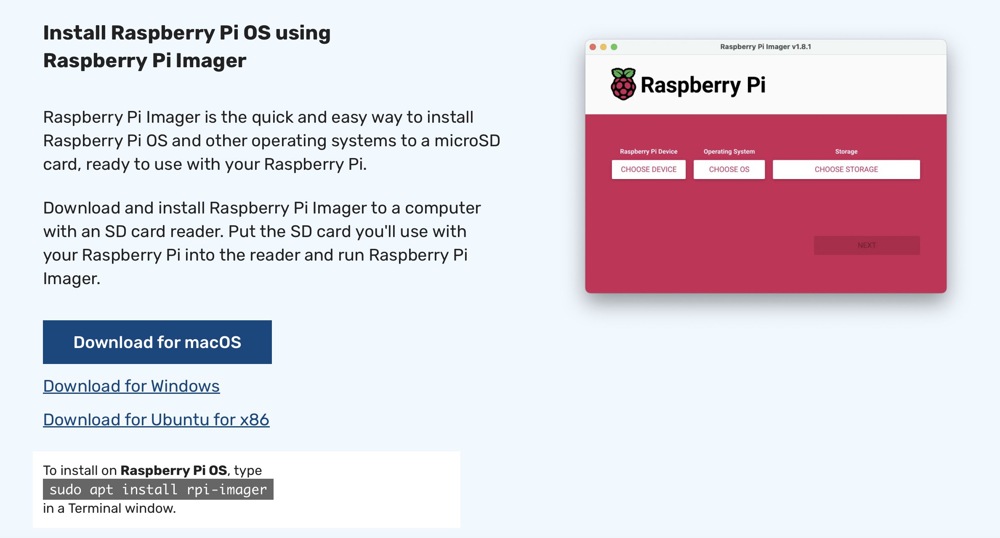

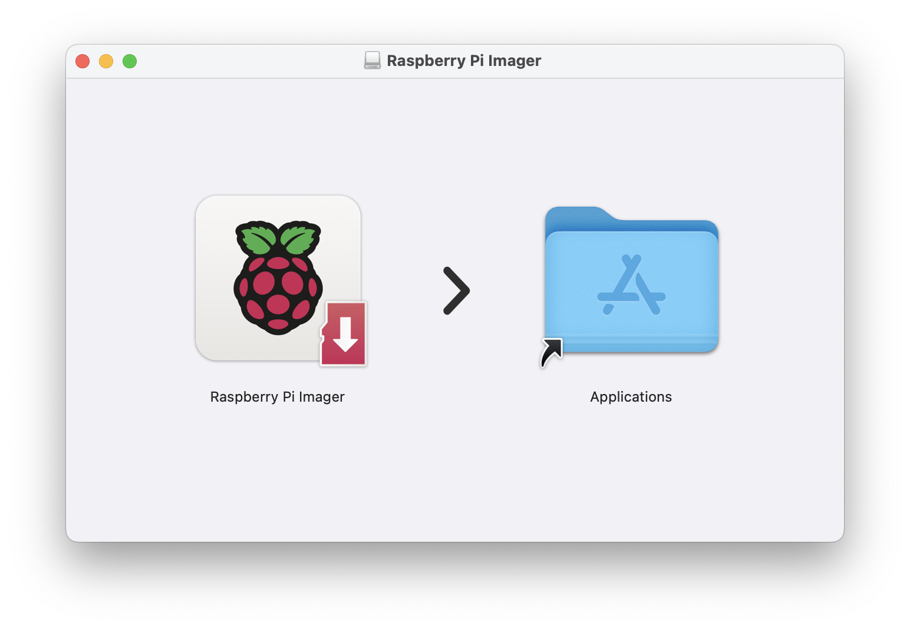

### 烧录器总览

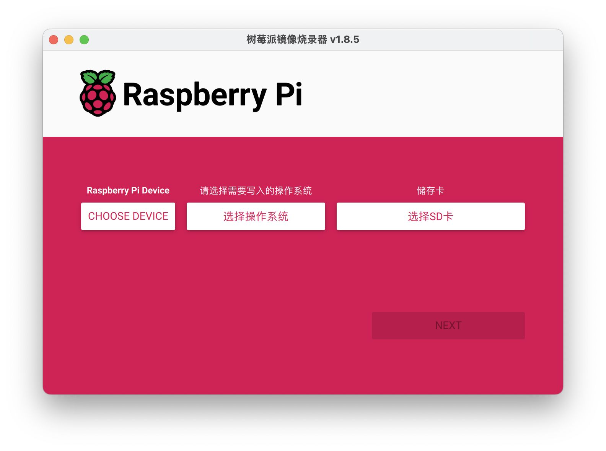

### 选择设备

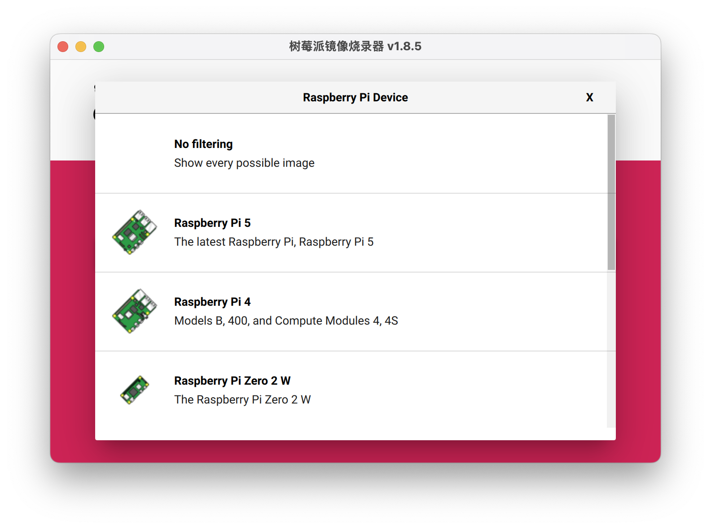

### 选择OS

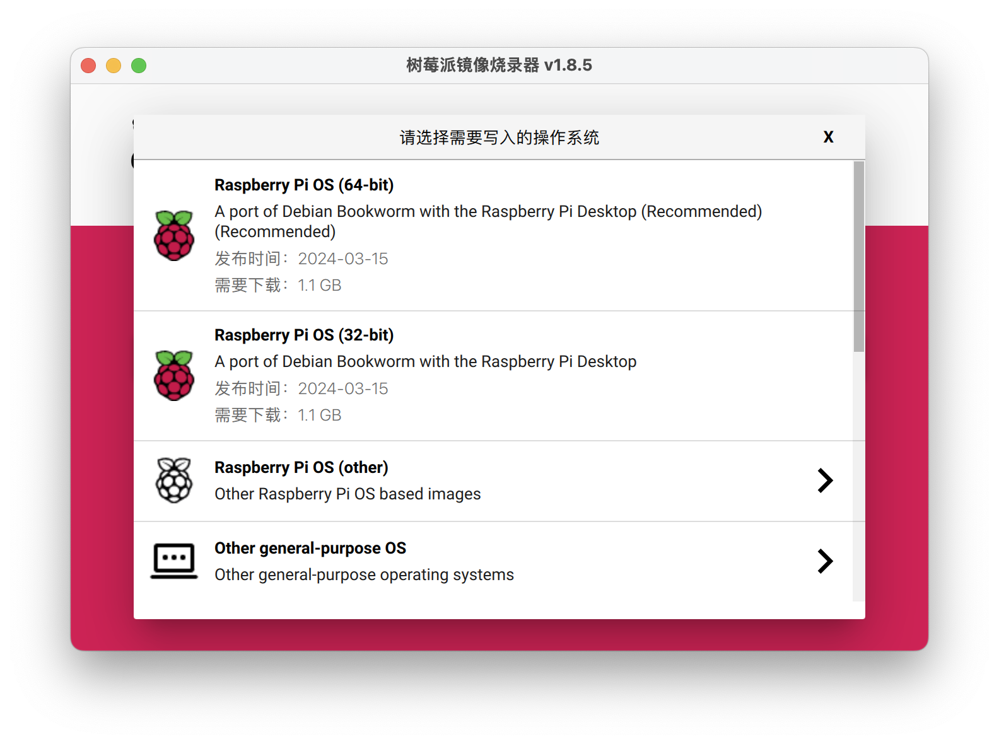

点击


### 预先配置

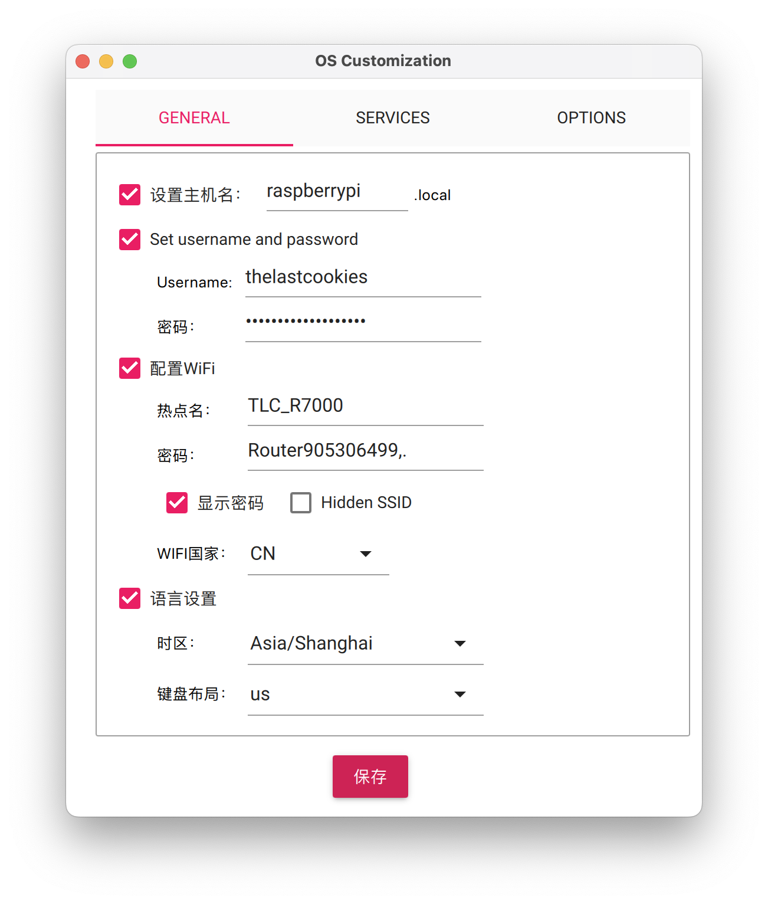
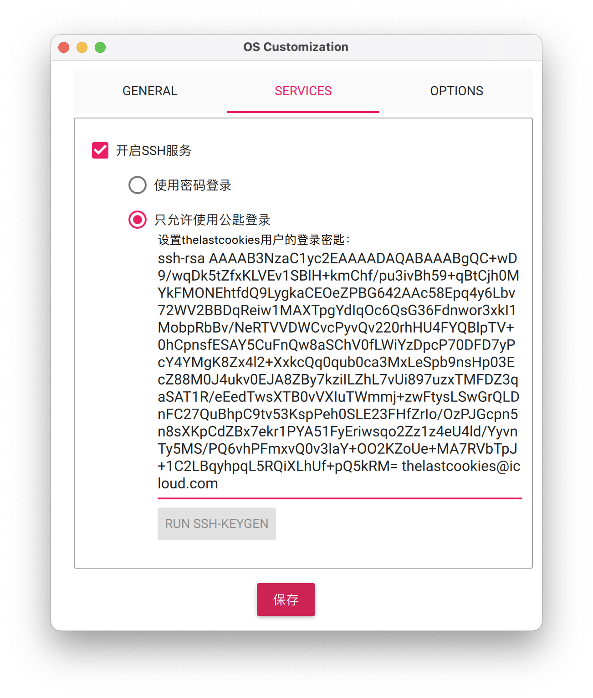
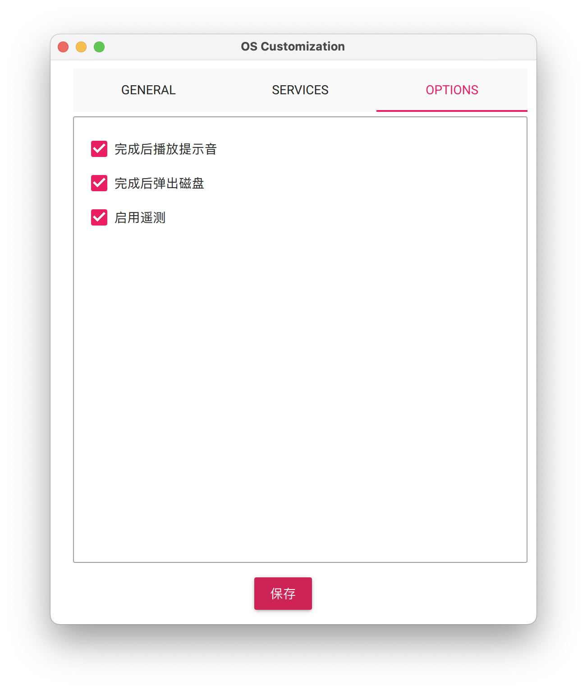

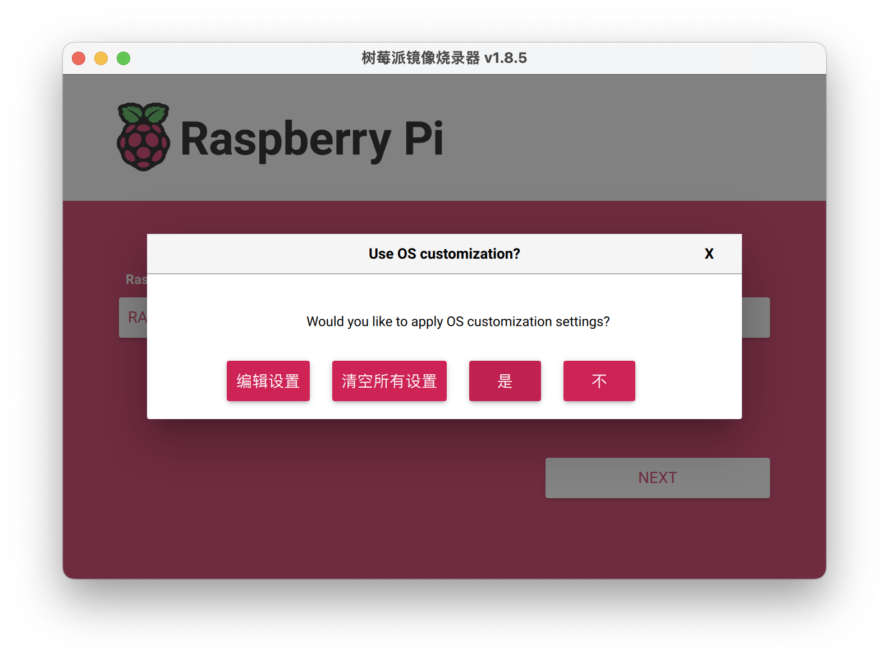

### 开始烧录

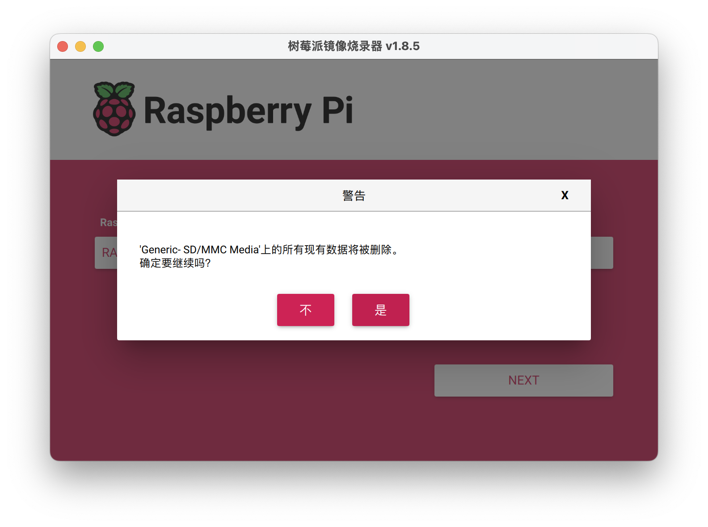
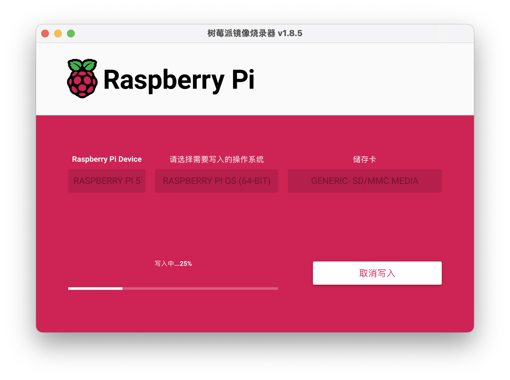

### 烧录完成

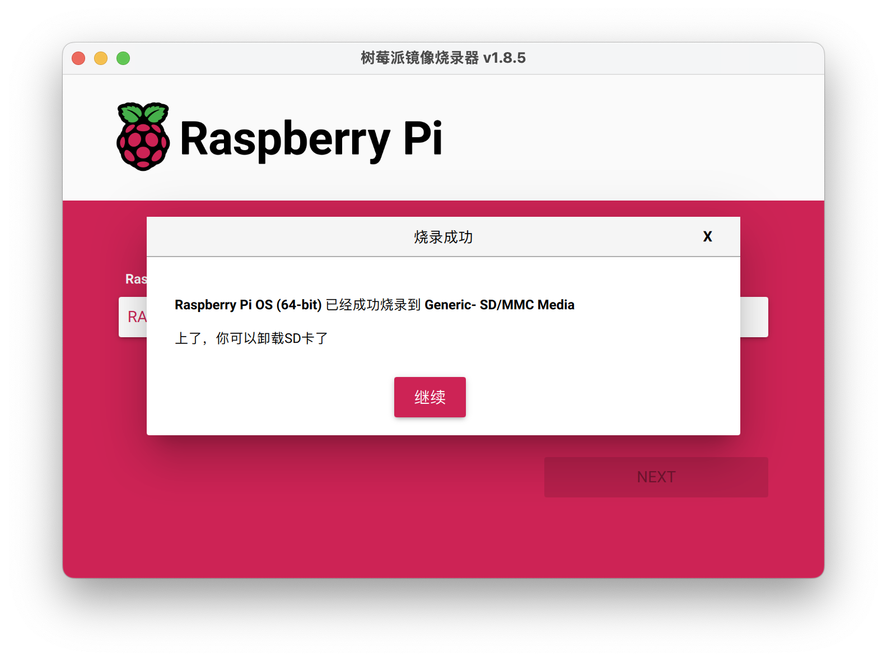

## SSH 环境

```shell
➜ macbook-pro .ssh > ssh-keygen -f raspberrypi -C username@macbook-pro
Generating public/private rsa key pair.
Enter passphrase (empty for no passphrase): 
Enter same passphrase again: 
Your identification has been saved in raspberrypi
Your public key has been saved in raspberrypi.pub
The key fingerprint is:
SHA256:dqI6398KX6oHv7uPF4jrDk1OizZghlQL7baiW0Sqaq4 username@macbook-pro
The key's randomart image is:
+---[RSA 3072]----+
|  ...            |
|   o..           |
|  o..            |
| + .o            |
|. o.+.  S...     |
|...o.. Oo+. .    |
|....  * =+  ..   |
|oo  .o +.oo=.    |
|Eo  .o.o=+XBo    |
+----[SHA256]-----+
```

```shell
➜ macbook-pro .ssh > ssh-copy-id -i raspberrypi username@10.0.0.2
/usr/bin/ssh-copy-id: INFO: Source of key(s) to be installed: "raspberrypi.pub"
/usr/bin/ssh-copy-id: INFO: attempting to log in with the new key(s), to filter out any that are already installed
/usr/bin/ssh-copy-id: INFO: 1 key(s) remain to be installed -- if you are prompted now it is to install the new keys
username@10.0.0.2's password: 

Number of key(s) added:        1

Now try logging into the machine, with:   "ssh 'username@10.0.0.2'"
and check to make sure that only the key(s) you wanted were added.
```

```shell
➜ macbook-pro .ssh > eval "$(ssh-agent -s)"
Agent pid 95473
➜ macbook-pro .ssh > ssh-add ~/.ssh/raspberrypi
Identity added: /Users/xxx/.ssh/raspberrypi (username@macbook-pro)
➜ macbook-pro .ssh > ssh username@10.0.0.2
Linux raspberrypi 6.6.20+rpt-rpi-2712 #1 SMP PREEMPT Debian 1:6.6.20-1+rpt1 (2024-03-07) aarch64

The programs included with the Debian GNU/Linux system are free software;
the exact distribution terms for each program are described in the
individual files in /usr/share/doc/*/copyright.

Debian GNU/Linux comes with ABSOLUTELY NO WARRANTY, to the extent
permitted by applicable law.
Last login: Thu Apr 18 00:49:39 2024 from 10.0.0.10

```

## .NET 环境

下载 Linux Arm64 Binaries

```shell
https://download.visualstudio.microsoft.com/download/pr/1e449990-2934-47ee-97fb-b78f0e587c98/1c92c33593932f7a86efa5aff18960ed/dotnet-sdk-8.0.204-linux-arm64.tar.gz
```

手动安装

```shell
sudo mkdir -p /etc/dotnet
sudo tar zxf dotnet-sdk-8.0.204-linux-arm64.tar.gz -C /etc/dotnet
```

编辑 shell 配置文件添加命令

```shell
echo 'export PATH=$PATH:/etc/dotnet' >> ~/.zshrc
echo 'export DOTNET_ROOT=/etc/dotnet' >> ~/.zshrc
source ~/.zshrc
```

## Node 环境

由于 `apt list` 中的 `node` 环境版本很低，例如`2024-04-30`当天的 node 版本为 `v18.19.0`，而官方最新版为 `22.0.0`。

因此要借用 apt 安装 `node version` 管理工具 `n`，然后使用 `n` 来安装和管理 `node` 环境。

安装 `node` 与 `npm`

```shell
sudo apt update && sudo apt install nodejs npm
```

安装 `n`

```shell
sudo npm install -g n
```

卸载 apt 安装的 `node`、 `npm` 并清理不必要的依赖项。

```shell
sudo apt remove nodejs npm -y
&& sudo apt autoremove -y 
```

使用 `n` 安装 `node latest`

```shell
sudo n latest
```

```
installing : node-v22.0.0
     mkdir : /usr/local/n/versions/node/22.0.0
     fetch : https://nodejs.org/dist/v22.0.0/node-v22.0.0-linux-arm64.tar.xz
   copying : node/22.0.0
 installed : v22.0.0 (with npm 10.5.1)
```

查看安装结果

```shell
➜ raspberrypi / > node -v
v22.0.0
➜ raspberrypi / > npm -v 
10.5.1
```


## Aria2

```shell
docker run -d \
    --name aria2 \
    --restart unless-stopped \
    --log-opt max-size=1m \
    -e PUID=$UID \
    -e PGID=$GID \
    -e UMASK_SET=022 \
    -e LISTEN_PORT=6888 \
    -p 6888:6888 \
    -p 6888:6888/udp \
    -v ~/Downloads/aria2/config:/config \
    -v ~/Downloads/aria2/downloads:/downloads \
    p3terx/aria2-pro
```
