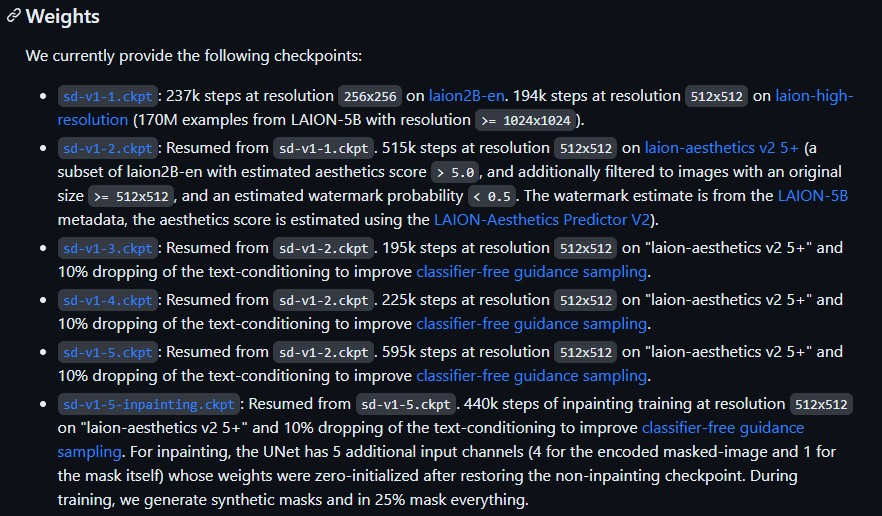

# 👩🏻‍🏫 Stable Diffusion 环境搭建

> 以下为作者搭建 SD 环境的全部过程，以及遇到的一些问题。考虑到不同操作系统、硬件配置等的差异，经验可能有局限性，但是总体的思路是值得借鉴的。

## 什么是 Stable Diffusion?
Stable Diffusion 是一种潜在的 `text-to-image`、`image-to-image` 扩散模型。

## 为什么使用 Stable Diffusion web UI?
[stable-diffusion-webui](https://github.com/AUTOMATIC1111/stable-diffusion-webui) 是大神 AUTOMATIC1111 发布的一款浏览器端的 Stable Diffusion 图形界面，可以在个人环境中部署，便于训练和调试。

## 本地环境（作者实际）
- 操作系统：Windows 10（5年内不升11😋）
- 显卡：RTX 4070Ti 12G（NOTE：官方要求显存要大于 10G）
- CUDA：11.7
- Python：3.10.6（NOTE：似乎必须是此版本，[官网链接](https://www.python.org/downloads/release/python-3106/)）


## 自动化安装
[stable-diffusion-webui](https://github.com/AUTOMATIC1111/stable-diffusion-webui) clone 或下载后，运行 `webui-user.bat`。

### 若 Pytorch 等依赖下载缓慢
更改 pip 源来加速下载。

指令：
```shell
$ pip config set global.index-url [url]
```

清华源：

```
https://pypi.tuna.tsinghua.edu.cn/simple/
```

阿里源：

```
https://mirrors.aliyun.com/pypi/simple/
```

腾讯源：

```
http://mirrors.cloud.tencent.com/pypi/simple/
```

豆瓣源：

```
http://pypi.douban.com/simple/
```

如果此前没有更改过 pip 源，则会在 `C:\Users\[User]\AppData\Roaming\pip` 下生成一个 `pip.ini`。

在 `pip.ini` 中添加 host 信任与超时时间，最终内容如下（以阿里源为例）：

```
[global]
timeout = 6000
index-url = https://mirrors.aliyun.com/pypi/simple/
trusted-host = mirrors.aliyun.com
```

> 最佳实践：通过自动化脚本下载 `pytorch`，手动下载一定要注意 CUDA 和 torch 版本的匹配问题。
> 
> ```python
> >>> import torch
> >>> print(torch.version.cuda)
> 11.7
> >>> print(torch.__version__)
> 1.13.1+cu117
> ```

---

### 若出现 `Couldn't install gfpgan` 等类似提示

为 GitHub 连接超时等问题导致部分依赖无法下载安装。

在设置上面 pip 换源的前提下，配置 GitHub 加速。

方法可以参考 [github_acc.md](../../utils/git/github_acc.md)

> 最佳实践：通过 GitHub 加速一劳永逸地解决这个问题！之前踩这个坑的时候看到网上很多人主张将每个库手动 clone 之后再 pip 安装，只能说极不优雅还容易出错，折腾的还是自己😅。
---

### 若出现 `No module 'xformers'` 提示

未安装 `xformers` 导致。

`xformers` 是一个 NVIDIA 显卡加速程序，据说可以减少缓存需求，并大大节省图片生成时间。但在 SD 中不是必需环境，并且有人反馈使用 `xformers` 反而速度更慢，发热也更严重，所以可以自行决定是否安装。

安装方式：以***编辑模式***打开 `webui-user.bat`，在 `set COMMANDLINE_ARGS=` 后面加上 `--xformers`，再次运行 `webui-user.bat` 时就会自动安装。 


```bat
@echo off

set PYTHON=
set GIT=
set VENV_DIR=
set COMMANDLINE_ARGS=--xformers

call webui.bat
```
---

### 若出现 `No checkpoints found` 提示

为缺少模型的提示。

官方提供了一系列预训练模型。链接：[stable-diffusion on GitHub](https://github.com/runwayml/stable-diffusion#weights)

其中有 `sd-v1-1` 到 `sd-v1-5` 的模型下载（2023.04.23）。




或者可以选择直接点击这里下载： [v1-5-pruned.ckpt - 7.7GB](https://huggingface.co/runwayml/stable-diffusion-v1-5/resolve/main/v1-5-pruned.ckpt)


模型下载完毕后放入路径：
```
[你的SD目录]\models\Stable-diffusion
```

之后再次运行 `webui-user.bat`。

---

### 环境部署成功

命令行出现：
```shell
Running on local URL:  http://127.0.0.1:7860
```

则 Stable Diffusion web UI 服务启动，环境配置部分结束。