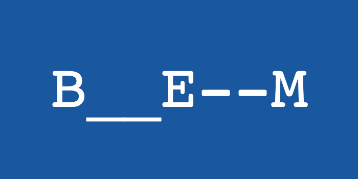

# [BEM](https://getbem.com) - CSS 命名方法论

> ***There are only two hard problems in Computer Science: cache invalidation and naming things — Phil Karlton***



## 什么是 BEM ？

BEM 是块（Block）、元素（Element）、修饰符（modifier）的简写，是由 Yandex 团队提出的一种 CSS 命名方法论，
旨在帮助开发者约定代码的命名规范，创建可复用、便于维护的组件，
非常适合大型项目的开发团队。

## Why BEM ？

### 模块化
块与块之间解耦，不会造成命名空间的污染。

### 可复用性
有合适的样式指南，就可以创建一个 block 库，

以灵活的方式组合各种 block 实现大量复用，可以减少 CSS 代码的维护量。

### 代码结构
BEM 提供了一套清晰可辨认、易于理解的命名风格。

## 重要概念

### 块（Block）

一个块是设计或布局的一部分，它有具体且唯一的意义。块与块之间可以嵌套，但在语义上他们保持相等，没有优先级或等级。

块的名称可以由拉丁字母、数字和 `-` 组成。CSS 类由 `.` 加块名组成。

示例：

```css
.block { color: #FF4500; }
```
```html
<div class="block"></div>
```

### 元素（Element）

元素作为块的组成部分，没有独立的意义。任何元素在语义上都与其块相关联。

元素的名称可以由拉丁字母、数字、`-` 和 `_` 组成。CSS 类由块名加上 `__` 再加元素名组成。

示例：
```css
.block { color: #042; }
.block__elem { color: #FF4500; }
```
```html
<div class="block">
    <div class="block__elem"></div>
</div>
```
### 修饰符（Modifier）

修饰符是快或元素上的标志。用于描述其外观、行为或状态。

修饰符的名称可以由拉丁字母、数字、`-` 和 `_` 组成。
CSS 类由块或元素的名称加上 `--` 组成。
如果修饰符较为复杂，则使用 `-` 代替其中的空格。

示例：
```css
.block { color: #042; }
.block--warning { color: #F00 }
.block--size-big { ... }
```
```html
<div class="block block--warning"></div>
<div class="block block--size-big"></div>
```

对于一个块或元素，由于不同的环境，可能会存在两种以上的状态。使用 BEM 设置样式时，可以使用 `block--modifier-value` 规则。

示例：

```css
.btn { ... }
.btn--state-success { ... }
.btn--state-warning { ... }
.btn--state-error { ... }
```

## BEM 与 LESS
利用 LESS 这类的预处理器语言来编写 BEM 风格的代码会变得非常简单优雅。
```less
.block {
  ...
  &__header { ... }
  &__body { ... }
  &--size-big { ... }
}
```

## 最佳实践

- 全局、公共模块/组件的样式定义，是 BEM 可以大放异彩的最佳场合。
- 避免出现深层次的嵌套，导致类名过长且可读性降低。
- 块的类名可以加一些描述性的前缀，可以起到类似命名空间的作用，增强代码可读性。
  如：`.ul-block`，`.com-button`
